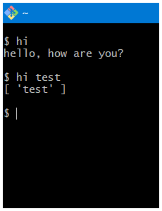

# hi

Hello world CLI Package which uses Node JS

I built this to learn how to make CLI Apps with Node JS

**I learnt by watching this video**

[](https://www.youtube.com/watch?v=_oHByo8tiEY)

## Preview



## How to use

Since this provides an executable you will have to Globally Install the Package.

### Running with npm

```bash
npm install -g @s54a-hi
```

Then, you can execute it with:

```bash
hi
```

### Running with npx

You can also run the CLI without installing it globally by using npx:

```bash
npx @s54a-hi
```

## Source Code

```js
#!/usr/bin/env node

const argv = process.argv;

const [, , ...args] = process.argv;

if (args.length === 0) {
  console.log("hello, how are you?");
} else {
  console.log(args);
}
```

## Output

_Command to run the CLI Script or App =_ **hi**
_Output =_

```
hello, how are you?
```

_Command with Arguments =_ **hi test**
_Output =_

```
[ 'test' ]
```

_Command with Arguments =_ **hi t e s t**
_Output =_

```
[ 't', 'e', 's', 't' ]
```

## File Structure

    @s54a-hi
    ├── dist
    │ └── index.js
    ├── node_modules
    ├── src
    │ └── index.ts
    ├── .gitignore
    ├── image.png
    ├── License
    ├── package-lock.json
    ├── package.json
    ├── Readme.md
    └── tsconfig.json

## License

This project is licensed under the MIT License - see the [LICENSE](LICENSE) file for details.

---
